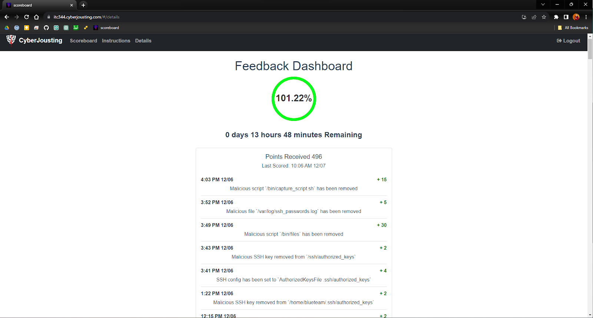

# Memo

**To:** Veridian Solutions  
**From:** Zac Conlin, Security Analyst  
**Subject:** Security of Main Server  
**Date:** 5 December 2023

## Purpose

My purpose for writing this is to provide the results of my analysis and changes to the main Veridian Solutions server, and to suggest new policies and practices to safeguard the systems going forward.

## Background

Having recently been hired as the new Security Analyst, I have been looking into and setting up the main server for the Veridian Solutions operations. My predecessor had left the system with considerable amounts of vulnerabilities and malware, so my job has been to clean up the remnants and to shore it up against future attacks.

## What Did I Find, and What Did I Do to Fix It?

Below is a list of malware and vulnerabilities I found on the systems, as well as the steps I took to fix them. I also included any new configurations I added.

1. The first thing that I noticed right away was a train appearing and obscuring the terminal when attempting to list the working directory. After some research, I discovered that this is a well-known malware called ‘sl,’ and I removed it by deleting it from the games folder and purging it from the system. Then I had to fix the aliases it had changed.

2. There was an annoyance of periodically getting kicked off the server, so one of the first things I did was to run a script that I wrote to add my ssh keys to the server to allow for easier connection. Then, I located a malicious script in the sbin directory that was killing my existing ssh session periodically, and seemed to be running from one of the users. It is unclear at this moment if this was orchestrated from Albert himself, or if a bad actor was using his account to do so. Getting rid of the file and removing the permissions in visudo did the trick and no longer booted me from my connection anymore.

3. The next step was to restore all users’ .bashrc files, which had been corrupted by malicious lines. I used a script to cycle through all the users on the system and restore them to their defaults.

4. Another thing of malware that was particularly noticeable was a cow that would periodically appear in the terminal and grant some fortune cookie message. I found a file in one of the users’ home directories that was running a script with a fortune broadcast, and also found in the binary files another script that ran the cow. Deleting the two of these, and removing it from the games directory as well, got rid of the malware.

5. I kept seeing hints of a program called My Flask App all over the system, and it took some hunting to find it all. It was in the /opt directory, a process was running, it was in the binary files, and one of the users had it in his home directory. Removing all of those and killing the running process got rid of it.

6. I found a line with several names in it in the sources.list, not sure if it was old employees or accomplices of the corporate spy, but it seemed to be taunting me and Veridian Solutions, so I deleted that line.

7. One of the pieces of critical infrastructure is the Apache2 webserver, which wasn’t functioning properly, so I purged Apache2. In order to reinstall it, I had to reconfigure the missing Ubuntu repos that Apt draws from, so I added them back. After that, and updating the system, I was able to install Apache2 and get it running. Then, just in case something changes and it goes down, I made a backup of the directory so that I can restore it if anything were to happen. After that, I was able to update and upgrade the system.

8. Once that was running, I had to get the firewall set up. I used UFW, and poked holes into it for ssh, http, and https.

9. Something the company had indicated was important to it was that the message of the day displays properly, and it was clear that the bad actor had tampered with this, as an unhelpful message displayed instead telling administrators to uninstall apache. I fixed the MOTD and ensured that it now displays correctly.

10. I usually use vim when text editing, so this next one went under the radar for some time, but eventually, I realized that when attempting to use nano to do so, it redirects to vim for some reason. In the bin files, I located the binary file pointing the nano command to vim, then uninstalled and reinstalled nano to get it working as intended.

11. Next was to set the password policy, which I did with libpam-pwnquality. I changed the pam.d/common-password file to do md5 hashing and to require 8 digits of password, one of which must be uppercase.

12. Looking at the users, I realized that one user seemed off and didn’t fit the company standards. Thus, I removed the albertay user, and proceeded to add the other 8 required user accounts. I made permission groups (sudo, IT, leadership, and general) and added the proper users to them. Then I created the folder structure indicated by the company, creating the Board_of_Directors directory with all its subdirectories, assigning each subdirectory to the proper permissions and owner based on their role within the company.

13. Once I had those users and permissions set up, I could add ssh keys to those with the proper permissions and roles, and configuring the server to only allow those with keys (the sudo group) to ssh into the server. While I was at it, I restricted root login, empty passwords, allowed groups, max sessions, and the max auth attempts. After putting their keys in their home directories and managing their permissions, only certain users can now ssh into the server, and they can only do so with their keys – no passwords. I also realized that there were some ssh keys that I didn’t know, and weren’t connected to any known employee, so I cleared them out.

14. I noticed that some of the /etc files had incorrect permissions, namely the shadow, sshd_config, and passwd files. I changed them to 640, 644, and 644 respectively.

15. Then I configured the sysctl.conf file to turn on Source Address Verification in all interfaces to prevent some spoofing attacks, and prevented some Meddler in the Middle attacks by denying ICMP redirects. I also turned on execshield.

16. Looking into the system’s cronjobs, I found one that continuously installs several hacking tools onto the server via a reverse shell, and so removed the cronjob and purged them from the system. There were some malicious cronjobs for some of the users too, so I wiped the crontab for each user while I was at it.

17. PHP can be vulnerable, so I locked it down by configuring its .ini file. Among other things, I turned off expose_php, limited the execution time, disabled several functions, and denied uploading of files. I then locked the .ini with chattr so that it can’t be altered.

18. I took a similar approach to hardening FTP, by installing and adjusting several of the configurations to restrict many of the open functionalities.

19. I found a log file that logs ssh passwords, but fortunately since users can’t log in with those passwords anyways, simply removing it did the trick.

20. I isolated an unwanted program called binz, which had users and executables all over the server. I removed every instance that I could find and removed the user from the /etc/sudoers file.

21. Just in case, since it’s not being used, I disabled IPv6 by setting it to off in the modprobe.d directory.

22. Looking into my own user (blueteam)’s home, I found several unwanted and potentially malicious files. I cleared out my home directory, erasing most pre-existing files.

23. Attempting to update the packages to their most recent version, I found that the pinned packages were keeping some of the packages on old versions. I removed those pins and updated the packages.

24. While browsing through the binary files, I found a large unidentifiable one ambiguously named “files”. Not knowing what it was, I deleted it and nothing seemed to break on the server, so I knew it was either bloatware or malware.

25. I also found some malicious scripts that logged the ssh passwords of users getting into the servers. This was a great vulnerability, and I removed them and any connection to them very quickly.

26. At this point, I am sufficiently pleased with how secure the systems are. I am aware of several attacks on other companies in similar situations, and have thus far been successful in avoiding most, and in patching the vulnerabilities that allowed for the few that got through. I will continue to work on improving the defense of our systems after this report is submitted to continually improve their efficiency.

## Suggestions for New Policies and Practices to Safeguard Computer Systems

In order to maintain this more secure system, I have laid out several ideas to implement in the company and its systems.

1. **Regular Security Audits:** In order to not let any vulnerabilities go unnoticed, implement regular security audits to detect any anomalies, vulnerabilities, or unauthorized activities on the server.

2. **User Training and Awareness for Employees:** Conduct security awareness training for all users to educate them on common security threats, social engineering attacks, and best practices for maintaining a secure computing environment. Much of what I saw was likely put on their systems unwittingly via an email link or some other phishing means.

3. **Multi-Factor Authentication (MFA):** Enforce multi-factor authentication for all user accounts, especially those with elevated privileges, to add an extra layer of security.

4. **Continuous Monitoring:** Set up continuous monitoring tools to track system activities, logins, and critical file changes. Also, establish alerts for suspicious activities. There are many good programs out there that allow for this and are worth the expenses.

5. **Regular Backup and Disaster Recovery:** Implement regular and automated backups of critical data and configurations. Test the restoration process periodically to ensure a quick recovery in case of a security incident or system failure. This can mitigate potentially disastrous consequences in just a couple of minutes.

6. **Access Control Review:** Periodically review and update user access permissions. Remove unnecessary privileges and accounts to minimize the attack surface. Permissions were a mess on this system, keeping them managed is much easier and safer than realizing too late that things are incorrectly configured.

The systems are now much more secure, and with continual work on them and on the policies I suggested, they will continue to increase in security. Thank you for your time.

